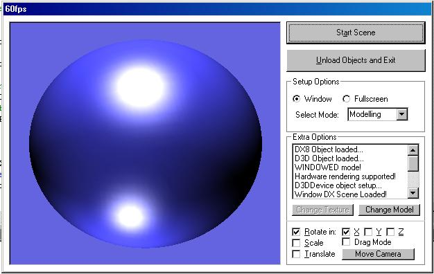



## THE FINAL DIRECTX TUTORIAL\!

### Description

Whew! I've finally finished my DirectX8 tutorial for D3D, and it's looking good! Fully commented (far too much)! Featuring:  

*Vertices!!  

*Lighting!!  

*TEXTURING!!! (featuring Lukas!)  

*MODELLING!!!?!?! (nice spheres)  

*Rotations and stuff! Woo yeah!  

Vote if you like! Feel free to steal stuff from it! Comment please!
 
### More Info
 

             |
---                |---
**Submitted On**   |2002-03-31 16:55:12
**By**             |[necromunda](https://github.com/Planet-Source-Code/PSCIndex/blob/master/ByAuthor/necromunda.md)
**Level**          |Advanced
**User Rating**    |5.0 (50 globes from 10 users)
**Compatibility**  |VB 6\.0
**Category**       |[DirectX](https://github.com/Planet-Source-Code/PSCIndex/blob/master/ByCategory/directx__1-44.md)
**World**          |[Visual Basic](https://github.com/Planet-Source-Code/PSCIndex/blob/master/ByWorld/visual-basic.md)
**Archive File**   |[THE\_FINAL\_671403312002\.zip](https://github.com/Planet-Source-Code/necromunda-the-final-directx-tutorial__1-33257/archive/master.zip)

### API Declarations

Gotta have DX8 for this!

